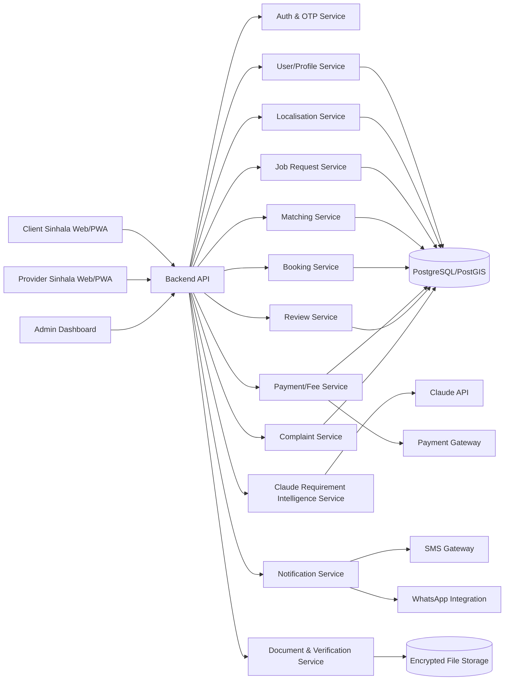
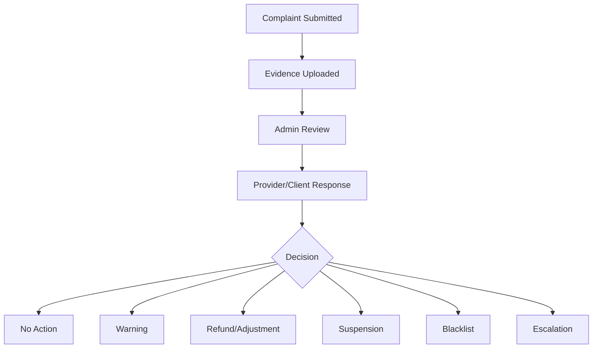
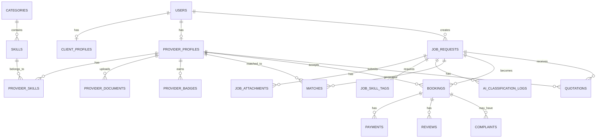

# Sinhala-First Workforce Marketplace Web App – Final Model Architecture v1.2

**Project purpose:** Build a Sinhala-first, web-based/PWA managed workforce marketplace for Sri Lanka. The platform connects clients who need work done with suitable individual workers, skilled tradespeople, professionals, work teams, and registered businesses.

**Important product decision:** This is **not** a simple worker-contact directory. It is a **managed marketplace** that controls provider verification, requirement capture, matching, booking/contact release, fee capture, reviews, complaints, and admin oversight.

**Primary language decision:** The public app should be **Sinhala-first**. English and Tamil support should be designed into the architecture from day one, but Sinhala is the default launch language.

**AI decision:** Client requirement identification, interpretation, classification, missing-question generation, and initial mapping to available workforce resources should be handled through **Claude API integration**. The final database filtering, eligibility checks, scoring, and ranking should remain deterministic in the backend.

---

## 0. Executive Build Instruction for Coding Agent

Build a **mobile-first Sinhala web/PWA managed workforce marketplace** for Sri Lanka with three major user views:

1. **Client view** – for people or organisations posting work requirements.
2. **Provider view** – for workers, skilled tradespeople, professionals, work teams, and registered businesses.
3. **Admin view** – for verification, manual matching, complaints, payments/fees, and operational control.

The MVP must support:

- Sinhala-first UI
- OTP login
- client profile
- provider profile
- provider skill/category selection
- service-area/location setup
- document upload
- admin verification and badge assignment
- job posting
- Claude API-based requirement interpretation
- job-to-skill mapping
- missing-question generation
- standard, quote-request, and assisted-RFQ job flows
- provider shortlisting
- controlled contact unlocking or booking
- basic fee/commission recording
- two-sided reviews
- complaints/disputes
- role-based admin dashboard
- audit logging
- privacy-by-design for NIC, photo, certificates, police-clearance documents, addresses, and sensitive files

Use a modular backend with clear services for authentication, profiles, categories/skills, jobs, Claude requirement intelligence, matching, bookings, verification documents, payments/fees, reviews, complaints, notifications, and admin operations.

---

## 1. Product Definition

The platform connects two sides:

### Demand side: clients / work requesters

Examples:

- household client
- property owner
- small business
- contractor
- construction client
- office/business client
- professional-service client

### Supply side: workforce providers

Examples:

- unskilled worker
- skilled tradesperson
- professional
- work team
- registered business
- subcontractor
- agency/manpower supplier, later phase only

### Core value proposition

> Clients can describe a work requirement in Sinhala, upload photos/documents, and receive suitable verified workforce recommendations based on skill, location, availability, verification level, rating, job risk, and price fit. Providers receive qualified job opportunities. The platform earns revenue through booking fees, contact unlock fees, commissions, RFQ/project fees, subscriptions, and later premium verification or visibility services.

---

## 2. Strategic Product Model

## 2.1 Recommended model

Use a **managed marketplace model**, not a pure directory.

### Why

If the system simply provides worker phone numbers, the client and provider can bypass the platform. Therefore, the platform must control the marketplace value points:

1. provider verification
2. structured requirement capture
3. Claude-assisted requirement mapping
4. provider eligibility filtering
5. provider shortlisting
6. booking/contact release
7. payment/fee capture
8. review history
9. dispute and complaint support
10. repeat-job management

## 2.2 Marketplace service levels

| Service level | Description | Launch phase |
|---|---|---|
| Directory preview | client sees limited profile information | MVP |
| Contact unlock | client pays/unlocks provider contact after shortlist | MVP |
| Managed booking | platform records booking, fee, acceptance, completion | MVP |
| Quote request | provider submits quotation for semi-standard work | MVP/Phase 2 |
| Assisted RFQ | admin helps scope complex/non-standard work | Phase 2 |
| Escrow/milestone payment | platform holds/release payments | Later |
| Insurance/guarantee | optional trust product | Later |

---

## 3. Sinhala-First Language Architecture

## 3.1 Language policy

The app must launch as **Sinhala-first**.

### Default language

```text
Default locale: si-LK
Fallback locale: en
Future locale: ta-LK
```

### User-facing language

All public-facing MVP screens should be written in Sinhala:

- landing page
- registration
- login/OTP
- provider onboarding
- client job posting
- job-category selection
- skill labels
- verification badge labels
- matching results
- booking/contact unlock
- reviews
- complaints
- notifications
- error messages
- terms acceptance summary

### Admin language

Admin dashboard can initially be Sinhala + English mixed, but the data model must support translation fields.

## 3.2 Technical localisation requirements

Use an i18n structure from day one.

Recommended structure:

```text
/locales
  /si-LK/common.json
  /si-LK/client.json
  /si-LK/provider.json
  /si-LK/admin.json
  /en/common.json
  /en/client.json
  /en/provider.json
  /en/admin.json
  /ta-LK/common.json
```

### UI requirements

- Use UTF-8 everywhere.
- Use Sinhala-compatible fonts in the frontend.
- Use language keys instead of hardcoded text.
- Keep Sinhala text short and practical for mobile screens.
- Avoid complex official Sinhala where simple user language is better.
- Support Sinhala, Singlish, and English inputs in job descriptions.
- Use icons and examples to support lower digital-literacy users.

## 3.3 Database multilingual fields

Categories, skills, badge names, and system content must support Sinhala first.

Example table columns:

```text
name_si
name_en
name_ta
description_si
description_en
description_ta
```

MVP display rule:

```text
If Sinhala value exists -> show Sinhala
Else -> show English fallback
```

## 3.4 Example Sinhala UI labels

| English concept | Sinhala UI label |
|---|---|
| Post a job | වැඩක් දැමීම |
| Find workers | වැඩකරුවන් සොයන්න |
| Select category | සේවා වර්ගය තෝරන්න |
| Upload photos | ඡායාරූප එකතු කරන්න |
| Budget range | වියදම් පරාසය |
| Urgent | හදිසි |
| Get quotes | මිල ගණන් ලබාගන්න |
| Book provider | සේවා සපයන්නා වෙන්කරගන්න |
| Contact unlocked | සම්බන්ධතා විස්තර ලබාදී ඇත |
| ID verified | හැඳුනුම්පත තහවුරු කර ඇත |
| Police clearance submitted | පොලිස් නිෂ්කාශන සහතිකය ඉදිරිපත් කර ඇත |
| Submit complaint | පැමිණිල්ලක් ඉදිරිපත් කරන්න |

---

## 4. Claude API Requirement Intelligence Layer

## 4.1 Purpose

Claude API should be used to interpret natural-language client requirements and convert them into structured job data.

Claude should help with:

1. understanding Sinhala/Singlish/English job descriptions
2. classifying job category and subcategory
3. identifying skill tags
4. detecting job type: STANDARD, QUOTE_REQUEST, ASSISTED_RFQ
5. identifying missing information
6. generating follow-up questions in Sinhala
7. detecting safety/risk flags
8. recommending minimum verification requirements
9. generating RFQ/work-brief drafts
10. generating Sinhala recommendation explanations
11. supporting admin review of complex jobs

## 4.2 Critical AI governance rule

Claude should **not** directly decide final provider selection.

Claude should produce structured interpretation. The backend should perform deterministic filtering, eligibility checks, scoring, and ranking.

Correct design:

```text
Client Sinhala requirement
      ↓
Claude Requirement Intelligence Service
      ↓
Structured job schema + skill tags + missing questions + risk flags
      ↓
Backend matching engine
      ↓
Hard filters + match score
      ↓
Top 3–5 provider shortlist
```

Wrong design:

```text
Client requirement
      ↓
Claude directly selects provider phone numbers
```

Do not do the wrong design.

## 4.3 Data that may be sent to Claude

Allowed, with user consent and data minimisation:

- client free-text job description
- selected category, if any
- uploaded job photos only when needed and consented
- general location: district/city
- preferred date/time
- budget range
- service taxonomy
- anonymised provider capability summary when needed
- previous job requirement context for same job

## 4.4 Data that must not be sent to Claude

Do not send:

- NIC numbers
- NIC/passport images
- police clearance documents
- full client address before booking
- phone numbers
- WhatsApp numbers
- bank details
- payment card data
- private admin notes
- raw complaint evidence unless legally/operationally approved
- sensitive documents
- unnecessary personal identifiers

## 4.5 Claude service module

Create a backend service:

```text
RequirementIntelligenceService
```

Responsibilities:

- call Claude API
- maintain prompt templates
- send taxonomy context
- request structured JSON
- validate Claude output
- calculate confidence level
- trigger manual review if confidence is low
- log AI outputs safely
- avoid storing unnecessary prompt data
- retry and timeout handling
- fallback to manual category selection if Claude fails

## 4.6 Claude API implementation rules

- Store API key in environment variable: `ANTHROPIC_API_KEY`
- Store model name in environment variable: `ANTHROPIC_MODEL`
- Do not hardcode model names in business logic.
- Use server-side calls only. Never expose API key in frontend.
- Use strict JSON output validation.
- Do not accept Claude output blindly.
- All AI-generated category/skill IDs must be checked against the database.
- Keep prompt versions in the database or config repository.
- Add audit logs for AI-assisted classification events.
- Use timeouts and retry limits.
- Provide manual fallback.

## 4.7 Claude output schema

Claude should return JSON in the following structure.

```json
{
  "detected_language": "si-LK",
  "normalised_requirement_summary_si": "නාන කාමරයේ නල කාන්දුවක් අලුත්වැඩියා කිරීම සඳහා plumber කෙනෙකු අවශ්‍යයි.",
  "normalised_requirement_summary_en": "Client needs a plumber to repair a bathroom pipe leak.",
  "job_type": "STANDARD",
  "category_key": "plumbing",
  "subcategory_key": "pipe_leak_repair",
  "skill_tags": [
    "pipe_leak_repair",
    "bathroom_plumbing",
    "minor_repair"
  ],
  "required_provider_type": "SKILLED_INDIVIDUAL",
  "required_workers_count": 1,
  "urgency": "TODAY_OR_TOMORROW",
  "risk_flags": [
    "water_damage_risk"
  ],
  "minimum_verification_level": "ID_VERIFIED",
  "materials_question_required": true,
  "site_visit_required": false,
  "missing_information": [
    "exact_leak_location",
    "photos_of_leak",
    "preferred_time",
    "whether_materials_are_available"
  ],
  "follow_up_questions_si": [
    "කාන්දුව ඇති ස්ථානයේ ඡායාරූපයක් එකතු කළ හැකිද?",
    "වැඩය කිරීමට ඔබට අවශ්‍ය දිනය සහ වේලාව කුමක්ද?",
    "අවශ්‍ය ද්‍රව්‍ය ඔබ සපයනවාද, නැතිනම් වැඩකරු සපයිය යුතුද?"
  ],
  "confidence": 0.88,
  "requires_admin_review": false
}
```

## 4.8 Claude classification confidence rules

| Confidence | Action |
|---:|---|
| >= 0.85 | Auto-accept classification |
| 0.65–0.84 | Accept but ask missing questions |
| 0.40–0.64 | Ask clarification before matching |
| < 0.40 | Send to admin/manual category selection |

## 4.9 Claude job-type decision logic

Claude should suggest one of three job types.

| Job type | Meaning |
|---|---|
| STANDARD | simple, repeatable, directly matchable |
| QUOTE_REQUEST | semi-standard work requiring provider quote |
| ASSISTED_RFQ | complex/custom work requiring admin or structured RFQ |

Examples:

| Requirement | Job type |
|---|---|
| “නාන කාමරයේ නල කාන්දුවක් තියෙනවා” | STANDARD |
| “ගෙදර කාමර දෙකක් paint කරන්න ඕන” | QUOTE_REQUEST |
| “වහලේ frame එකයි sheet එකයි gutter එකයි හදන්න ඕන” | ASSISTED_RFQ |
| “BOQ එකක් prepare කරලා estimate එකක් දෙන්න” | QUOTE_REQUEST |
| “සති 3කට masons 5ක් සහ helpers 3ක් ඕන” | ASSISTED_RFQ |

## 4.10 Claude prompt template

Use a prompt template like this.

```text
You are a requirement-classification assistant for a Sinhala-first workforce marketplace in Sri Lanka.

Your task is to convert the client's requirement into structured JSON.

Rules:
- Understand Sinhala, Singlish, Tamil, and English.
- Output JSON only.
- Do not invent facts.
- If information is missing, ask follow-up questions in Sinhala.
- Use only category_key and skill_tags from the provided taxonomy.
- Do not choose a provider.
- Do not expose or request sensitive identity documents from the client.
- Flag safety risks such as electrical work, height work, water damage, heavy lifting, child/elderly access, and property access.
- If the requirement is complex, classify it as ASSISTED_RFQ.
- If confidence is low, set requires_admin_review = true.

Provided taxonomy:
{{taxonomy_json}}

Client requirement:
{{client_requirement}}

Client selected category:
{{selected_category_or_null}}

General location:
{{district_or_city_only}}

Budget:
{{budget_or_null}}

Return JSON using this schema:
{{schema}}
```

## 4.11 Claude-related API endpoints

```http
POST /api/ai/classify-job
POST /api/ai/generate-follow-up-questions
POST /api/ai/create-rfq-brief
POST /api/ai/recommendation-explanation
POST /api/ai/admin-summary
```

## 4.12 Example AI workflow

```text
1. Client types Sinhala requirement.
2. Backend sends description + taxonomy to Claude.
3. Claude returns structured classification.
4. Backend validates category and skill IDs.
5. If missing information exists, UI asks Sinhala follow-up questions.
6. Client answers.
7. Backend creates final job request.
8. Matching engine applies hard filters and scoring.
9. Client receives top 3–5 recommendations.
```

---

## 5. User Roles

## 5.1 Client / Work Requester

A person or organisation that needs work done.

Examples:

- household client
- small business
- property owner
- construction client
- contractor
- professional-service client

## 5.2 Workforce Provider

A person, team, professional, or business offering work.

Provider types:

- UNSKILLED_INDIVIDUAL
- SKILLED_INDIVIDUAL
- PROFESSIONAL
- WORK_TEAM
- REGISTERED_BUSINESS
- AGENCY, later phase only

## 5.3 Admin / Operations Team

Internal team controlling:

- provider verification
- document review
- badge assignment
- job review
- manual matching
- RFQ support
- complaints
- suspensions
- category management
- payment/fee monitoring
- analytics

## 5.4 Super Admin

Owner-level role controlling:

- platform fees
- admin users
- sensitive access permissions
- financial settings
- deletion/anonymisation approvals
- legal/compliance settings

---

## 6. MVP Scope

## 6.1 Launch geography

Start with one dense geography.

Suggested options:

- Colombo and suburbs
- Colombo + Gampaha
- one district where strong provider supply can be manually recruited

## 6.2 MVP categories

Start narrow.

1. Plumber
2. Electrician
3. Mason
4. Carpenter
5. Painter
6. Tiler
7. Welder
8. AC technician
9. Cleaner
10. Helper / labourer

## 6.3 MVP platform type

Build:

```text
Mobile-first responsive web app / PWA
```

Do not start with full native Android/iOS unless budget and team capacity are strong.

## 6.4 MVP must include

- Sinhala-first UI
- OTP authentication
- client registration
- provider registration
- provider profile creation
- skill/category selection
- service location/radius
- document upload
- admin verification
- verification badges
- Claude requirement classification
- Sinhala follow-up questions
- job posting
- job photo/document upload
- matching and shortlist
- booking/contact unlock
- basic payment/fee recording
- two-sided reviews
- complaint handling
- admin dashboard

## 6.5 Defer until later

- full native mobile apps
- full escrow
- insurance guarantee
- overseas expansion
- complex enterprise manpower contracts
- full automation of all matching decisions
- police-clearance requirement for all workers
- native in-app calling
- advanced AI agent autonomy

---

## 7. High-Level System Architecture



---

## 8. Core Modules

## 8.1 Authentication Module

### Functions

- mobile OTP login
- role-based access
- session management
- device tracking
- account lock/suspension
- admin MFA, recommended

### User roles

```text
CLIENT
PROVIDER
ADMIN
SUPER_ADMIN
```

### MVP rule

Mobile OTP is mandatory for both clients and providers.

---

## 8.2 Localisation Module

### Functions

- serve Sinhala UI labels
- manage translations
- support English fallback
- future Tamil support
- store category/skill/badge names in Sinhala, English, Tamil
- generate Sinhala notification templates
- generate Sinhala error messages

### Suggested tables

```text
translation_keys
translation_values
notification_templates
content_pages
```

### translation_keys

- id
- key
- namespace
- description
- created_at

### translation_values

- id
- translation_key_id
- locale
- value
- status
- updated_by
- updated_at

### notification_templates

- id
- template_key
- locale
- channel
- subject
- body
- status

---

## 8.3 User and Profile Module

### Client profile data

Required:

- full name
- mobile number
- preferred language, default Sinhala
- client type: household, business, contractor, professional client

Optional / conditional:

- email
- WhatsApp number
- business name
- business registration number
- billing details
- saved addresses

### Provider profile data

Required:

- full legal name
- mobile number
- WhatsApp number
- profile photo
- provider type
- main category
- sub-skills
- district/city
- service radius
- preferred language
- availability status

Optional / conditional:

- NIC/passport data
- address
- emergency contact
- police clearance certificate
- certificates
- business registration
- professional membership
- portfolio photos
- references
- tools/equipment owned
- team size
- rate structure
- work history

---

## 8.4 Provider Verification Module

### Verification badge system

Do not use one vague “Verified” badge. Use specific badges.

| Badge code | Sinhala label | Meaning |
|---|---|---|
| MOBILE_VERIFIED | දුරකථන අංකය තහවුරු කර ඇත | OTP verified |
| ID_VERIFIED | හැඳුනුම්පත තහවුරු කර ඇත | NIC/passport reviewed |
| PHOTO_VERIFIED | ඡායාරූපය තහවුරු කර ඇත | live/profile photo matched |
| ADDRESS_SUBMITTED | ලිපිනය ලබාදී ඇත | address submitted |
| PCC_SUBMITTED | පොලිස් නිෂ්කාශන සහතිකය ඉදිරිපත් කර ඇත | police clearance uploaded/date recorded |
| SKILL_EVIDENCE_UPLOADED | කුසලතා සාක්ෂි ඉදිරිපත් කර ඇත | certificate/portfolio/reference uploaded |
| CREDENTIAL_VERIFIED | සුදුසුකම් තහවුරු කර ඇත | credential checked |
| BUSINESS_REGISTERED | ව්‍යාපාර ලියාපදිංචිය තහවුරු කර ඇත | BR evidence checked |
| PLATFORM_VETTED | වේදිකාව මගින් පරීක්ෂා කර ඇත | admin/manual vetting completed |
| HIGHLY_RATED | ඉහළ ඇගයීමක් ඇත | strong rating/completion record |

### Verification states

```text
PENDING
APPROVED
REJECTED
EXPIRED
NEEDS_RESUBMISSION
```

### Sensitive document rule

Store verification results separately from raw files. Raw files must be encrypted, access-controlled, and governed by retention policy.

---

## 8.5 Category and Skills Taxonomy Module

### Structure

```text
Sector → Category → Subcategory → Skill Tags
```

Example:

```text
Construction & Repair
  → Roofing
      → Steel roof framing
      → Timber roof framing
      → Sheet fixing
      → Gutter fixing
      → Flashing
      → Height work
      → Surface preparation
      → Painting/coating
```

### MVP categories

| Key | Sinhala label |
|---|---|
| plumbing | නල කාර්මික සේවා |
| electrical | විදුලි කාර්මික සේවා |
| masonry | මේසන් වැඩ |
| carpentry | වඩු වැඩ |
| painting | තීන්ත ආලේපන |
| tiling | ටයිල් වැඩ |
| welding | වෙල්ඩින් වැඩ |
| ac_repair | AC අලුත්වැඩියා |
| cleaning | පිරිසිදු කිරීම |
| general_labour | සාමාන්‍ය කම්කරු සේවා |

### Future categories

- QS services
- engineering services
- drafting/CAD/BIM
- roofing teams
- aluminium works
- waterproofing
- event workers
- logistics workers
- industrial labour
- agriculture labour
- office support

---

## 8.6 Job Request Module

### Job types

| Job type | Use case | Matching mode |
|---|---|---|
| STANDARD | simple repeatable job | instant shortlist |
| QUOTE_REQUEST | semi-standard skilled job | provider quotations |
| ASSISTED_RFQ | complex/custom job | admin-assisted RFQ |

### Standard job fields

- client_id
- job_title
- original_description
- ai_normalised_summary_si
- ai_normalised_summary_en
- category_id
- subcategory_id
- skill_tags
- location/address
- latitude/longitude
- district/city
- preferred date/time
- urgency
- budget range
- photos/videos
- materials supplied by client/provider/unknown
- safety risk flags
- required verification level
- need site visit: yes/no
- number of workers needed
- Claude confidence score
- requires admin review
- job status

### Construction/RFQ additional fields

- work package
- approximate quantity
- drawing available: yes/no
- BOQ available: yes/no
- labour only or supply-and-fix
- site visit required
- project duration
- payment milestones
- warranty expectation
- special conditions

---

## 8.7 Matching Engine

### Matching flow

```text
1. Receive structured job request.
2. Use Claude output only as interpretation input.
3. Validate category/skills against database.
4. Apply hard filters.
5. Calculate match score.
6. Rank providers.
7. Return top 3–5 providers.
8. Record match event for analytics.
```

### Hard filters

Provider must satisfy:

- active account
- not suspended
- category match
- skill match
- service area match
- availability match
- minimum verification requirement
- team size requirement, if any
- required credential, if any
- not blocked by client/admin
- budget compatibility, where available
- risk eligibility

### Match score formula

```text
Match Score =
  25% Skill Match
+ 15% Availability
+ 15% Location Proximity
+ 15% Verification Level
+ 10% Rating
+ 10% Similar Job History
+  5% Response Speed
+  5% Budget Fit
```

### Match score pseudocode

```pseudo
function generateShortlist(job):
    assert job.category_id is not null
    assert job.skill_tags are validated

    providers = getActiveProviders()

    providers = filter(providers, providerHasCategory(job.category_id))
    providers = filter(providers, providerHasSkills(job.skill_tags))
    providers = filter(providers, providerServesLocation(job.location))
    providers = filter(providers, providerIsAvailable(job.preferred_start_at))
    providers = filter(providers, providerMeetsVerification(job.required_verification_level))
    providers = filter(providers, providerEligibleForRisk(job.safety_flags))
    providers = filter(providers, notBlockedOrSuspended(provider, job.client_id))

    scored = []

    for provider in providers:
        score = 0
        score += skillMatch(provider.skills, job.skill_tags) * 0.25
        score += availabilityScore(provider, job) * 0.15
        score += proximityScore(provider, job.location) * 0.15
        score += verificationScore(provider.badges) * 0.15
        score += ratingScore(provider.rating_average) * 0.10
        score += similarJobScore(provider.history, job) * 0.10
        score += responseSpeedScore(provider.response_stats) * 0.05
        score += budgetFitScore(provider.rates, job.budget) * 0.05

        scored.append(provider, score)

    shortlist = sortByScore(scored).take(5)
    saveMatchResults(job.id, shortlist)
    return shortlist
```

### Recommendation explanation

The system may use Claude to generate Sinhala explanations using only non-sensitive shortlist facts.

Example Sinhala explanation:

```text
මෙම සේවා සපයන්නා plumbing repair සඳහා ගැලපේ, ඔබගේ ස්ථානයට ආසන්නයි, අද ලබාගත හැක, හැඳුනුම්පත තහවුරු කර ඇත, සහ සමාන වැඩ සඳහා හොඳ ඇගයීම් ඇත.
```

---

## 8.8 Booking and Contact-Control Module

### Booking states

```text
DRAFT
POSTED
AI_CLASSIFIED
NEEDS_CLARIFICATION
MATCHED
CONTACT_UNLOCK_PENDING
CONTACT_UNLOCKED
PROVIDER_REQUESTED
PROVIDER_ACCEPTED
CLIENT_CONFIRMED
IN_PROGRESS
COMPLETED
CANCELLED
DISPUTED
CLOSED
```

### Contact access policy

| Stage | Contact access |
|---|---|
| Browsing | no phone number |
| Shortlisted | profile only |
| Contact unlock paid | limited contact shared |
| Booking accepted | phone/WhatsApp shared |
| Job completed | contact retained in job history |

### Anti-leakage principle

The platform must monetise before full contact sharing or job confirmation.

---

## 8.9 RFQ / Custom Project Module

### When to use

Use RFQ for:

- multi-skill work
- construction packages
- team labour
- high-value work
- unclear scope
- professional deliverables
- site-visit-based quotations
- work requiring drawings, BOQ, or inspection

### RFQ flow

```text
1. Client submits custom requirement.
2. Claude classifies as QUOTE_REQUEST or ASSISTED_RFQ.
3. Claude drafts structured work brief.
4. Admin reviews/refines work brief if required.
5. Suitable providers are invited.
6. Providers submit quote and timeline.
7. Client compares quotes.
8. Client selects provider/team.
9. Booking/payment/commission recorded.
10. Job is completed and reviewed.
```

### RFQ quote fields

- provider_id
- job_id
- quote_amount
- labour/material breakdown
- timeline
- site visit requirement
- inclusions
- exclusions
- validity period
- payment terms
- attachments

---

## 8.10 Payment and Revenue Module

### MVP revenue methods

1. contact unlock fee
2. booking fee
3. platform service fee
4. commission on managed/RFQ jobs

### Later revenue methods

1. provider subscription
2. premium visibility boost
3. verification service fee
4. enterprise package
5. managed project/RFQ fee

### Payment entities

- payment
- invoice/receipt
- platform fee
- commission
- refund
- wallet balance, later
- ledger entry

### Ledger rule

All financial movements should be written as immutable ledger entries.

Example ledger entry types:

```text
CLIENT_PAYMENT
CONTACT_UNLOCK_FEE
BOOKING_FEE
PLATFORM_FEE
PROVIDER_PAYOUT
COMMISSION
REFUND
ADJUSTMENT
```

---

## 8.11 Review and Rating Module

### Client reviews provider

Rating dimensions:

- quality
- punctuality
- communication
- price fairness
- professionalism

### Provider reviews client

Rating dimensions:

- clarity of requirement
- payment behaviour
- site readiness
- communication
- safety/respect

### Review policy

- reviews only after completed/cancelled/disputed job
- admin moderation for abusive/fake content
- hidden review possible during dispute
- repeated poor ratings trigger admin review

---

## 8.12 Complaint and Dispute Module

### Complaint categories

- no-show
- late arrival
- poor workmanship
- price dispute
- damage to property
- theft/safety concern
- harassment/abuse
- fake profile/document
- non-payment
- scope disagreement

### Complaint flow



### Complaint states

```text
OPEN
AWAITING_RESPONSE
UNDER_REVIEW
RESOLVED
ESCALATED
CLOSED
```

---

## 8.13 Admin Dashboard

### Admin functions

- view new provider registrations
- approve/reject documents
- assign verification badges
- manage Sinhala/English/Tamil category labels
- review AI-classified jobs
- review low-confidence Claude classifications
- manually match complex jobs
- manage RFQ invitations
- handle complaints
- suspend/ban users
- view payments and commissions
- monitor KPIs
- export reports
- manage terms/privacy/content pages
- audit sensitive access

### Admin permissions

| Permission | Admin | Super Admin |
|---|---:|---:|
| View users | Yes | Yes |
| Approve documents | Yes | Yes |
| View sensitive documents | Limited | Yes |
| Suspend user | Yes | Yes |
| Delete/anonymise user | No | Yes |
| Manage finance | Limited | Yes |
| Change platform fees | No | Yes |
| Manage admin users | No | Yes |
| Manage AI prompts | No/Limited | Yes |
| Manage translations | Yes | Yes |

---

## 9. Data Architecture

## 9.1 Core Entity Relationship Diagram



---

## 9.2 Main Tables

### users

- id
- role
- name
- mobile
- mobile_verified_at
- email
- preferred_language
- status
- created_at
- updated_at

### client_profiles

- id
- user_id
- client_type
- business_name
- business_registration_no
- default_address_id
- rating_average
- rating_count

### provider_profiles

- id
- user_id
- provider_type
- display_name
- profile_photo_url
- district
- city
- latitude
- longitude
- service_radius_km
- years_experience
- rate_type
- rate_min
- rate_max
- availability_status
- rating_average
- rating_count
- completed_jobs_count
- response_time_avg
- status

### categories

- id
- parent_id
- key
- name_si
- name_en
- name_ta
- description_si
- description_en
- description_ta
- type
- status

### skills

- id
- category_id
- key
- name_si
- name_en
- name_ta
- risk_level
- requires_credential
- status

### provider_skills

- id
- provider_id
- skill_id
- proficiency_level
- years_experience
- evidence_required
- status

### provider_documents

- id
- provider_id
- document_type
- file_url
- document_number_masked
- issued_date
- expiry_date
- verification_status
- verified_by
- verified_at
- rejection_reason
- created_at

### provider_badges

- id
- provider_id
- badge_type
- status
- issued_at
- expires_at
- evidence_document_id

### job_requests

- id
- client_id
- job_type
- title
- original_description
- ai_normalised_summary_si
- ai_normalised_summary_en
- category_id
- subcategory_id
- location_address
- district
- city
- latitude
- longitude
- urgency
- preferred_start_at
- budget_min
- budget_max
- materials_by
- required_workers_count
- required_verification_level
- safety_flags_json
- ai_confidence
- requires_admin_review
- status
- created_at

### ai_classification_logs

- id
- job_id
- model_name
- prompt_version
- input_hash
- output_json
- confidence
- requires_admin_review
- status
- created_at

Important: do not store raw sensitive prompt content if avoidable. Store hashes and structured output. If full logs are needed for debugging, apply short retention and strong admin access control.

### job_attachments

- id
- job_id
- file_type
- file_url
- caption
- created_at

### job_skill_tags

- id
- job_id
- skill_id
- importance

### matches

- id
- job_id
- provider_id
- match_score
- score_breakdown_json
- recommendation_reason_si
- recommendation_reason_en
- status
- created_at

### bookings

- id
- job_id
- client_id
- provider_id
- booking_status
- agreed_amount
- platform_fee
- commission_amount
- start_at
- completed_at
- cancellation_reason
- created_at

### quotations

- id
- job_id
- provider_id
- quote_amount
- timeline_days
- inclusions
- exclusions
- payment_terms
- status
- valid_until
- created_at

### payments

- id
- booking_id
- payer_id
- payee_id
- amount
- payment_type
- payment_status
- gateway_reference
- created_at

### ledger_entries

- id
- payment_id
- booking_id
- entry_type
- debit_account
- credit_account
- amount
- currency
- created_at

### reviews

- id
- booking_id
- reviewer_id
- reviewee_id
- rating
- review_text
- review_type
- moderation_status
- created_at

### complaints

- id
- booking_id
- complainant_id
- respondent_id
- complaint_type
- description
- status
- admin_assigned_id
- resolution
- created_at

### admin_actions

- id
- admin_id
- action_type
- entity_type
- entity_id
- old_value_json
- new_value_json
- created_at

---

## 10. API Architecture

## 10.1 Authentication APIs

```http
POST /api/auth/request-otp
POST /api/auth/verify-otp
POST /api/auth/logout
GET  /api/auth/me
```

## 10.2 Localisation APIs

```http
GET  /api/i18n/{locale}
GET  /api/i18n/{locale}/{namespace}
GET  /api/categories?locale=si-LK
GET  /api/skills?categoryId={id}&locale=si-LK
```

## 10.3 Claude/AI APIs

```http
POST /api/ai/classify-job
POST /api/ai/generate-follow-up-questions
POST /api/ai/create-rfq-brief
POST /api/ai/recommendation-explanation
GET  /api/admin/ai/classification-logs
PATCH /api/admin/ai/classification-logs/{id}/review
```

## 10.4 Client APIs

```http
POST /api/client/profile
GET  /api/client/profile
PATCH /api/client/profile
POST /api/client/addresses
GET  /api/client/jobs
POST /api/client/jobs
GET  /api/client/jobs/{jobId}
PATCH /api/client/jobs/{jobId}
POST /api/client/jobs/{jobId}/attachments
POST /api/client/jobs/{jobId}/classify
POST /api/client/jobs/{jobId}/match
GET  /api/client/jobs/{jobId}/matches
POST /api/client/bookings
GET  /api/client/bookings
POST /api/client/bookings/{bookingId}/complete
POST /api/client/bookings/{bookingId}/review
POST /api/client/bookings/{bookingId}/complaint
```

## 10.5 Provider APIs

```http
POST /api/provider/profile
GET  /api/provider/profile
PATCH /api/provider/profile
POST /api/provider/skills
GET  /api/provider/skills
POST /api/provider/documents
GET  /api/provider/documents
PATCH /api/provider/availability
GET  /api/provider/leads
POST /api/provider/leads/{jobId}/accept
POST /api/provider/leads/{jobId}/decline
POST /api/provider/quotations
GET  /api/provider/bookings
PATCH /api/provider/bookings/{bookingId}/status
POST /api/provider/bookings/{bookingId}/review
POST /api/provider/bookings/{bookingId}/complaint
```

## 10.6 Admin APIs

```http
GET  /api/admin/dashboard
GET  /api/admin/providers/pending
GET  /api/admin/providers/{providerId}
PATCH /api/admin/providers/{providerId}/status
PATCH /api/admin/documents/{documentId}/verify
GET  /api/admin/jobs
GET  /api/admin/jobs/{jobId}
POST /api/admin/jobs/{jobId}/manual-match
GET  /api/admin/complaints
PATCH /api/admin/complaints/{complaintId}
GET  /api/admin/payments
GET  /api/admin/reports/kpis
POST /api/admin/categories
PATCH /api/admin/categories/{categoryId}
POST /api/admin/skills
PATCH /api/admin/skills/{skillId}
POST /api/admin/translations
PATCH /api/admin/translations/{translationId}
```

---

## 11. Main Workflows

## 11.1 Provider onboarding workflow

```text
1. Provider opens Sinhala app.
2. Provider enters mobile number.
3. OTP verification.
4. Select provider type.
5. Enter basic profile details.
6. Select categories and skills.
7. Add service area and availability.
8. Upload profile photo.
9. Upload NIC/passport for ID verification.
10. Optional: upload police clearance/certificates/BR/portfolio.
11. Admin reviews documents.
12. Provider receives verification badges.
13. Provider becomes eligible for matching.
```

## 11.2 Client job-posting workflow with Claude

```text
1. Client signs in with OTP.
2. Client describes requirement in Sinhala/Singlish/English.
3. Client may upload photos.
4. Backend sends minimal requirement data and taxonomy to Claude.
5. Claude returns category, skill tags, job type, risk flags, and missing questions.
6. UI asks Sinhala follow-up questions if required.
7. Client confirms the structured job.
8. Backend creates job request.
9. Matching engine applies hard filters and scoring.
10. Client views 3–5 recommended providers.
11. Client books, unlocks contact, or requests quote.
```

## 11.3 Standard booking workflow

```text
1. Client posts standard job.
2. Claude classifies and maps skills.
3. System shortlists providers.
4. Client selects provider.
5. Client pays contact unlock/booking fee.
6. Provider accepts/declines.
7. Contact shared after acceptance/payment trigger.
8. Work starts.
9. Client marks complete.
10. Payment/commission recorded.
11. Both parties review.
```

## 11.4 RFQ workflow

```text
1. Client submits complex/custom job.
2. Claude classifies as QUOTE_REQUEST or ASSISTED_RFQ.
3. Claude creates Sinhala work brief.
4. Admin reviews/refines work brief if needed.
5. Relevant providers invited.
6. Providers submit quotations.
7. Client compares quotes.
8. Client selects provider/team.
9. Booking and fee/commission recorded.
10. Work proceeds.
11. Completion, review, complaint handling if needed.
```

---

## 12. Privacy, Compliance, and Security Requirements

## 12.1 Compliance baseline

The platform processes personal and sensitive data. Privacy-by-design is mandatory.

Sensitive data includes:

- NIC/passport
- police clearance
- certificates
- business registration documents
- bank details
- home addresses
- profile photos
- complaint evidence

## 12.2 Required controls

- consent capture for each sensitive data category
- separate consent for document verification
- separate consent for sending job descriptions/photos to Claude where applicable
- data minimisation
- encryption at rest and in transit
- role-based access control
- admin access logs
- document access audit trail
- retention schedule
- deletion/anonymisation process
- user data access/correction request process
- privacy policy in Sinhala, Tamil, and English
- terms and conditions in Sinhala, Tamil, and English
- vendor processing agreements for payment, SMS, cloud, KYC, storage, and AI API vendors

## 12.3 Sensitive data handling

Do not expose raw documents to clients.

Expose only badges and limited verification statuses.

Example:

```text
ID Verified: Yes
NIC ending: ****123V
Verified date: 2026-06-03
Raw document: access restricted / retained according to policy
```

## 12.4 AI privacy rule

Claude should receive only the minimum data needed for requirement interpretation. Do not send provider identity documents, phone numbers, NICs, full addresses, payment data, or police-clearance files to Claude.

---

## 13. Legal/Declaration Content to Add to Platform

## 13.1 Platform role declaration

The platform is a technology intermediary connecting independent providers and clients. It is not the employer, contractor, supervisor, guarantor, or agent of providers unless expressly agreed in writing.

## 13.2 Verification disclaimer

Verification badges indicate that specific documents or information were submitted and reviewed at a particular date. Verification does not guarantee future conduct, workmanship, safety, honesty, or legal compliance.

## 13.3 Provider declaration

Providers are responsible for accurate information, lawful conduct, skill claims, tools, safety, taxes, licences, and quality of work.

## 13.4 Client declaration

Clients are responsible for confirming scope, price, materials, site access, safety conditions, and final acceptance before work begins.

## 13.5 Contact misuse declaration

Contact details shared through the platform may be used only for the relevant job and must not be misused, sold, harvested, or used for harassment or spam.

## 13.6 Off-platform circumvention clause

Users must not use platform introductions to avoid applicable platform fees for the same job or related follow-up work within a defined period.

## 13.7 AI declaration

AI-assisted requirement classification is used to improve job matching and request clarity. Final booking decisions, provider selection, prices, and work agreements remain the responsibility of the users and/or platform-admin review where applicable.

---

## 14. Technology Stack Recommendation

## 14.1 Frontend

Recommended:

- Next.js / React
- mobile-first responsive UI
- PWA support
- Sinhala-first i18n
- English/Tamil-ready translation system
- image compression before upload

## 14.2 Backend

Good options:

- Laravel
- Django
- Node.js/NestJS

For this project:

- Laravel is strong for fast marketplace/admin/payment development.
- Django is strong for admin, data structure, and security.
- NestJS is strong if the team prefers TypeScript full stack.

## 14.3 Database

- PostgreSQL
- PostGIS for location/radius matching

## 14.4 Storage

- encrypted object storage for documents and photos

## 14.5 Search

MVP:

- PostgreSQL full-text search

Later:

- Elasticsearch / OpenSearch / Typesense

## 14.6 AI integration

- Anthropic Claude API through backend service only
- environment variables for API key and model
- JSON schema validation
- retry/timeout handling
- prompt version control
- admin review for low-confidence cases

## 14.7 Notifications

- SMS OTP provider
- WhatsApp Business API later
- email for receipts and formal notices

## 14.8 Payments

- local payment gateway
- card/bank transfer support
- payment ledger from day one

## 14.9 Hosting

Use separate environments:

- development
- staging
- production

---

## 15. Non-Functional Requirements

## 15.1 Security

- HTTPS only
- passwordless OTP or strong password option
- JWT/session management
- rate limiting
- file upload validation
- virus/malware scan for uploads, later phase
- encryption for sensitive files
- admin MFA
- audit logs for sensitive data access

## 15.2 Performance

- job classification under acceptable UX time
- matching response under 3 seconds for MVP geography
- image compression for uploads
- pagination for provider/job lists
- cache category/skill taxonomy for Claude prompts

## 15.3 Reliability

- daily database backups
- audit logs
- error logging
- transaction-safe payments
- fallback if Claude API is unavailable

## 15.4 Scalability

- modular monolith is acceptable for MVP
- services can be split later
- keep matching logic separated
- keep AI classification service separated

## 15.5 Accessibility and localisation

- Sinhala-first
- Tamil/English-ready
- mobile-first forms
- low-bandwidth image compression
- clear icon-based navigation
- short Sinhala text for practical users

---

## 16. MVP Build Backlog

## Sprint 1 – Foundation

- project setup
- database schema
- user roles
- OTP authentication
- basic client/provider profiles
- admin login
- Sinhala i18n setup

## Sprint 2 – Category and language foundation

- category table
- skill table
- Sinhala labels
- English fallback
- translation keys
- category/skill management in admin

## Sprint 3 – Provider onboarding

- provider profile form
- category/skill selection
- service area setup
- document upload
- admin verification screen
- verification badge assignment

## Sprint 4 – Client job posting

- Sinhala job creation form
- free-text requirement input
- location input
- photo upload
- job categories
- job status system

## Sprint 5 – Claude requirement intelligence

- Anthropic/Claude API integration
- prompt templates
- structured JSON response validation
- missing-question generation
- Sinhala follow-up questions
- AI classification logs
- fallback/manual classification

## Sprint 6 – Matching engine

- hard filters
- match score calculation
- top 3–5 shortlist
- Sinhala recommendation explanation
- match history recording

## Sprint 7 – Booking/contact unlock

- client shortlist UI
- booking request
- provider accept/decline
- contact unlock state
- basic fee record

## Sprint 8 – Reviews and complaints

- two-sided reviews
- complaint submission
- admin complaint handling
- user suspension/blacklist

## Sprint 9 – Admin and reporting

- admin dashboard
- KPIs
- provider approval queue
- AI low-confidence review queue
- job monitoring
- payment/fee reports

## Sprint 10 – Stabilisation

- security review
- privacy text insertion
- terms acceptance
- Sinhala content review
- bug fixing
- pilot testing

---

## 17. MVP Acceptance Criteria

The MVP is acceptable when:

1. A provider can register in the Sinhala app, select skills, upload documents, and be approved by admin.
2. A client can post a job in Sinhala with description, location, date, budget, and photos.
3. Claude can classify the job into category, subcategory, skill tags, job type, missing questions, and risk flags.
4. The system can ask follow-up questions in Sinhala when required.
5. The backend can generate a ranked shortlist of 3–5 providers.
6. The client can request/book/unlock a provider.
7. The provider can accept or decline.
8. Contact is shared only after the defined trigger.
9. Both sides can review each other after completion.
10. Complaints can be submitted and handled by admin.
11. Admin can verify documents and suspend users.
12. Sensitive documents are not shown to clients.
13. AI does not receive NIC, police clearance, phone numbers, or full address data.
14. All major actions are audit logged.
15. Basic payment/fee/commission records are stored.

---

## 18. Critical Risks and Controls

| Risk | Control |
|---|---|
| Users bypass platform after contact sharing | contact unlock/booking fee before contact release |
| False worker identity | NIC + photo verification |
| Fake skill claims | badges, portfolio, references, ratings |
| Poor AI classification | confidence threshold + manual review |
| Sinhala misunderstanding | follow-up questions + admin review for low confidence |
| Data breach | encryption + access control + audit logs |
| Overpromising verification | badge-specific verification disclaimer |
| Scope disputes | structured job forms + RFQ work brief |
| Unsafe work | risk flags + minimum verification/credential levels |
| Low supply density | launch narrow geography/categories |
| Cold start | manually recruit first 50–100 providers |
| Legal exposure | Sri Lankan legal review before launch |

---

## 19. Final Coding-Agent Prompt

Use this prompt to start the coding build:

```text
Build a Sinhala-first mobile web/PWA managed workforce marketplace for Sri Lanka.

The platform has three role views: client, provider, and admin. The MVP must support OTP authentication, Sinhala UI, client job posting, provider onboarding, provider skills/categories, service areas, document upload, admin verification, verification badges, Claude API-based requirement classification, Sinhala follow-up questions, deterministic backend matching, ranked provider shortlisting, controlled contact unlock/booking, basic fee/commission recording, reviews, complaints, and admin dashboards.

Use PostgreSQL with PostGIS-capable location matching. Use a modular backend with services for auth, localisation, profiles, categories/skills, jobs, Claude requirement intelligence, matching, bookings, verification documents, payments/fees, reviews, complaints, notifications, and admin operations.

Claude API must be used only for requirement interpretation, category/skill mapping, missing-question generation, risk flagging, RFQ brief generation, and Sinhala recommendation explanations. Claude must not directly select final providers. The backend must validate all Claude outputs against the database and perform final hard filtering, scoring, and ranking.

The app must follow privacy-by-design because it handles NIC, profile photos, police-clearance documents, certificates, addresses, and user ratings. Do not send sensitive identity documents, phone numbers, payment data, police clearance, or full addresses to Claude. Use role-based access control, encrypted document storage, audit logs, and retention rules.

Build the MVP as a modular monolith first, with clean internal service boundaries so it can later scale into separate services.
```

---

## 20. Final Product Principle

The platform must not become a “phone-number website.”

It should become:

```text
Sinhala-first trusted workforce marketplace
= verified providers
+ intelligent requirement capture
+ Claude-assisted job mapping
+ deterministic provider matching
+ controlled booking/contact release
+ fee capture
+ ratings
+ complaint support
+ admin quality control
```

That is the model with commercial defensibility.


---

# v1.2 Integration Update – Rates, Team Quotations, Portfolio, Reviews, Calendar, and Financial Transparency

**Purpose of this update:** Strengthen the platform framework by properly integrating provider rates/daily wages, scope-based pricing for teams, work-image portfolios, two-sided review protection, availability calendars, booking slots, and location-aware scheduling.

This update should be treated as part of the final build specification. The coding agent must implement these modules as core marketplace features, not optional decorations.

---

## A. Updated Product Principle

The platform must not only match “available workers” with “available work.” It must also help both sides understand:

1. **What type of work is required**
2. **Who is capable of doing it**
3. **How much the provider usually charges**
4. **Whether the provider is available**
5. **Where the job is located**
6. **What previous work the provider has completed**
7. **Whether both parties are reliable**
8. **What commercial terms are agreed before work starts**

The improved product principle is:

```text
Sinhala-first trusted workforce marketplace
= verified providers
+ transparent rates
+ worker/team availability
+ portfolio-based selection
+ intelligent requirement capture
+ Claude-assisted job mapping
+ deterministic provider matching
+ controlled booking/contact release
+ price agreement
+ fee capture
+ two-sided reviews
+ complaint support
+ admin quality control
```

---

## B. Provider Pricing and Rate Transparency Module

## B.1 Why this module is required

Financial transparency protects both parties.

Clients need to know whether the provider is affordable before contacting or booking. Providers need to avoid clients who expect unrealistic rates. Common work such as gardening, household work, plumbing, electrical work, masonry, painting, cleaning, tiling, and welding may be priced differently depending on time, difficulty, urgency, location, tools, and materials.

Therefore, the platform must support **multiple pricing models**, not one simple rate field.

---

## B.2 Pricing models to support

Each provider can select one or more pricing methods.

| Pricing type | Best for | Example |
|---|---|---|
| HOURLY_RATE | Short time-based work | Rs. 800/hour |
| HALF_DAY_RATE | Small half-day tasks | Rs. 3,500/half day |
| DAILY_WAGE | Labour/trade work | Rs. 5,000/day |
| FIXED_SMALL_JOB_RATE | Common repeatable jobs | Rs. 2,500 to fix minor leak |
| CALL_OUT_FEE | Inspection/visit charge | Rs. 1,000 visit fee |
| EMERGENCY_RATE | Urgent/night work | +25% urgent surcharge |
| UNIT_RATE | Measurable work | Rs. 150/sq.ft tiling labour |
| TEAM_DAY_RATE | Team work by day | Rs. 30,000/day for 5-person team |
| SCOPE_BASED_QUOTE | Complex/custom work | Quotation after photos/site visit |
| PROFESSIONAL_FEE | QS/drafting/engineering work | Per drawing, BOQ, estimate, or report |

---

## B.3 Individual provider rate fields

For individual workers, collect:

- preferred pricing type
- hourly rate
- half-day rate
- daily wage
- minimum charge
- call-out/inspection fee
- emergency surcharge
- weekend/holiday surcharge
- night-work surcharge
- travel fee rule
- rate negotiability
- material cost included: yes/no
- tools included: yes/no
- rate validity date
- admin-approved status

### Example individual rate profile

```json
{
  "provider_id": 1001,
  "rate_type": "DAILY_WAGE",
  "daily_wage": 5000,
  "half_day_rate": 3000,
  "hourly_rate": null,
  "minimum_charge": 2500,
  "call_out_fee": 1000,
  "emergency_surcharge_percent": 25,
  "travel_fee_policy": "Free within 10 km, negotiable beyond that",
  "materials_included": false,
  "tools_included": true,
  "negotiable": true,
  "currency": "LKR"
}
```

---

## B.4 Team/business provider pricing fields

Teams and businesses often charge based on scope, quantity, or work package.

For teams, collect:

- team size
- team composition
- team day rate
- minimum project value
- unit rates, if applicable
- labour-only option
- supply-and-fix option
- site visit required: yes/no
- free site visit or paid site visit
- quotation required: yes/no
- rate per square foot/meter/point/item where applicable
- payment terms
- advance requirement
- milestone-payment preference
- quotation validity period

### Example team profile

```json
{
  "provider_id": 2005,
  "provider_type": "WORK_TEAM",
  "team_size": 6,
  "team_composition": [
    {"role": "Mason", "count": 3},
    {"role": "Helper", "count": 2},
    {"role": "Supervisor", "count": 1}
  ],
  "team_day_rate": 42000,
  "minimum_project_value": 75000,
  "pricing_type": "SCOPE_BASED_QUOTE",
  "site_visit_required": true,
  "site_visit_fee": 3000,
  "labour_only_available": true,
  "supply_and_fix_available": true
}
```

---

## B.5 Category-specific pricing examples

| Category | Possible pricing models |
|---|---|
| Gardening | hourly, half-day, daily wage, per area, scope quote |
| Household work | hourly, half-day, daily wage |
| Plumbing | call-out fee, fixed small-job fee, hourly, quotation |
| Electrical | call-out fee, per point, fixed job, daily, quotation |
| Masonry | daily wage, unit rate, labour-only, scope quote |
| Carpentry | daily wage, item rate, scope quote |
| Painting | daily wage, per sq.ft, per room, scope quote |
| Tiling | per sq.ft, daily wage, labour-only, supply-and-fix |
| Welding | daily wage, per item, per length, scope quote |
| Roofing | per sq.ft, team day rate, supply-and-fix, RFQ |
| Cleaning | hourly, half-day, full-day, per house/office |
| AC repair | inspection fee, service fee, part-replacement quote |

---

## B.6 Rate transparency rules

The app should display rates clearly but safely.

### Client-facing display should show:

- indicative rate/range
- pricing type
- minimum charge
- call-out fee, if any
- whether materials are included
- whether tools are included
- whether travel fee may apply
- whether final quote is required
- rate validity/last updated date

### Client-facing display should not show:

- provider bank details
- internal commission settings
- private admin notes
- sensitive financial documents

### Example Sinhala rate display

```text
දෛනික වැටුප: Rs. 5,000
අවම ගාස්තුව: Rs. 2,500
පැමිණීමේ ගාස්තුව: Rs. 1,000
ද්‍රව්‍ය ඇතුළත් නොවේ
අවසාන මිල වැඩ පරාසය අනුව තහවුරු කළ යුතුය
```

---

## B.7 Price-agreement workflow

Before a booking becomes active, the system must capture an agreed commercial understanding.

### For standard jobs

Required:

- selected provider
- pricing type
- estimated cost/rate
- call-out fee, if any
- materials responsibility
- tools responsibility
- expected duration
- booking date/time
- cancellation policy
- platform fee/contact unlock fee

### For quote jobs

Required:

- provider quotation
- inclusions
- exclusions
- labour/material split
- payment terms
- quotation validity
- agreed start date
- expected duration

### For RFQ jobs

Required:

- work brief
- final quote
- milestone/payment terms
- scope assumptions
- variation rule
- site visit notes
- agreed provider/team

---

## B.8 Pricing states

```text
RATE_NOT_SET
RATE_DRAFT
RATE_SUBMITTED
RATE_ADMIN_REVIEW
RATE_APPROVED
RATE_REJECTED
RATE_EXPIRED
QUOTE_REQUIRED
```

---

## B.9 New pricing database tables

### provider_rate_profiles

- id
- provider_id
- currency
- primary_pricing_type
- hourly_rate
- half_day_rate
- daily_wage
- minimum_charge
- call_out_fee
- emergency_surcharge_percent
- weekend_surcharge_percent
- night_surcharge_percent
- travel_fee_policy
- materials_included
- tools_included
- negotiable
- rate_valid_from
- rate_valid_until
- approval_status
- admin_notes
- created_at
- updated_at

### provider_unit_rates

- id
- provider_id
- category_id
- skill_id
- unit_type
- unit_label_si
- unit_label_en
- labour_rate
- supply_and_fix_rate
- minimum_quantity
- remarks
- status

### provider_team_rates

- id
- provider_id
- team_size
- team_day_rate
- minimum_project_value
- site_visit_required
- site_visit_fee
- labour_only_available
- supply_and_fix_available
- advance_required_percent
- quotation_valid_days
- payment_terms
- status

### provider_team_composition

- id
- provider_id
- role_name
- skill_id
- count
- remarks

### job_price_agreements

- id
- job_id
- booking_id
- provider_id
- pricing_type
- estimated_amount
- agreed_amount
- call_out_fee
- labour_amount
- material_amount
- travel_amount
- platform_fee
- commission_amount
- payment_terms
- inclusions
- exclusions
- materials_by
- tools_by
- status
- agreed_at

---

## C. Provider Portfolio / Work Gallery Module

## C.1 Purpose

For many common and semi-custom jobs, clients will make decisions based on visual references. Gardening, household improvement, painting, tiling, masonry, carpentry, welding, roofing, cleaning, and renovation work are easier to judge through photos.

Therefore, each provider must have a **portfolio/work gallery**.

---

## C.2 Portfolio features

Providers can upload:

- previous work images
- before/after photos
- short project description
- category and skill tags
- approximate location/district
- year/month completed
- labour-only or supply-and-fix note
- project size, optional
- approximate value range, optional
- link to completed platform booking, if available
- verification status

---

## C.3 Portfolio display in shortlist

Each provider shortlist card should include:

- profile photo
- 3–5 portfolio thumbnails
- rating
- verification badges
- indicative rate
- availability
- distance
- “view previous work” button

This allows a client to pick a provider not only by price, but also by demonstrated capability.

---

## C.4 Portfolio quality controls

Admin should moderate portfolio images.

Reject or hide images if:

- unrelated to claimed skill
- contains offensive content
- reveals private client data without consent
- contains full faces of third parties without consent
- contains phone numbers/watermarks encouraging off-platform contact
- appears misleading or stolen
- is too low quality to be useful

---

## C.5 Portfolio verification levels

| Portfolio status | Meaning |
|---|---|
| SELF_UPLOADED | Provider uploaded; not verified |
| ADMIN_REVIEWED | Admin checked for basic relevance |
| PLATFORM_JOB_VERIFIED | Image linked to completed platform job |
| CLIENT_CONFIRMED | Client confirmed image relates to completed job |

---

## C.6 Portfolio table

### provider_portfolio_items

- id
- provider_id
- title_si
- title_en
- description_si
- description_en
- category_id
- skill_id
- image_url
- before_image_url
- after_image_url
- district
- completed_month
- completed_year
- project_size
- pricing_type_used
- approximate_value_range
- verification_status
- linked_booking_id
- admin_status
- created_at
- updated_at

---

## D. Two-Sided Review and Reputation System

## D.1 Purpose

Both parties need protection.

Clients must know whether the worker is reliable and skilled. Providers must know whether the client pays correctly, explains the work clearly, and behaves respectfully.

Therefore, reviews must be **two-sided**.

---

## D.2 Client reviews provider

Rating dimensions:

| Dimension | Meaning |
|---|---|
| Work quality | workmanship and output |
| Punctuality | arrived on time |
| Communication | clear and respectful communication |
| Price fairness | charged as agreed |
| Professional behaviour | trustworthy and respectful |
| Cleanliness/site care | especially for household/construction work |
| Completion | completed agreed scope |

### Provider rating formula

```text
Provider Rating =
  30% Work Quality
+ 15% Punctuality
+ 15% Communication
+ 15% Price Fairness
+ 15% Professional Behaviour
+ 10% Completion/Site Care
```

---

## D.3 Provider reviews client

Rating dimensions:

| Dimension | Meaning |
|---|---|
| Payment behaviour | paid correctly/on time |
| Requirement clarity | explained job properly |
| Site readiness | site/materials were ready |
| Communication | respectful and responsive |
| Scope fairness | did not add unpaid work unfairly |
| Safety/respect | safe working environment |

### Client rating formula

```text
Client Rating =
  30% Payment Behaviour
+ 20% Requirement Clarity
+ 15% Site Readiness
+ 15% Communication
+ 10% Scope Fairness
+ 10% Safety/Respect
```

---

## D.4 Review timing

Reviews can be submitted only after:

- job completed
- job cancelled after booking
- dispute closed
- provider declined due to serious client issue, optional admin-reviewed case

---

## D.5 Review visibility

### Client sees provider:

- overall rating
- work quality score
- punctuality score
- completed jobs
- cancellation/no-show rate
- portfolio images
- written reviews
- verification badges

### Provider sees client:

- overall client rating
- payment-behaviour score
- completed bookings
- cancellation/no-show rate
- limited written reviews
- complaint history summary, admin-only where sensitive

---

## D.6 Review moderation

Admin must be able to:

- hide abusive reviews
- flag suspected fake reviews
- lock reviews during disputes
- allow response to review
- remove personal data from reviews
- prevent phone numbers/contact details in reviews

---

## D.7 Review database additions

### reviews

- id
- booking_id
- reviewer_id
- reviewee_id
- review_direction: CLIENT_TO_PROVIDER / PROVIDER_TO_CLIENT
- rating_overall
- rating_work_quality
- rating_punctuality
- rating_communication
- rating_price_fairness
- rating_professional_behaviour
- rating_site_care
- rating_payment_behaviour
- rating_requirement_clarity
- rating_site_readiness
- rating_scope_fairness
- rating_safety_respect
- review_text
- moderation_status
- response_text
- created_at

### reputation_scores

- id
- user_id
- provider_profile_id
- client_profile_id
- rating_average
- rating_count
- completed_jobs_count
- cancellation_rate
- no_show_rate
- dispute_rate
- payment_reliability_score
- response_time_avg
- last_updated_at

---

## E. Availability Calendar and Booking Schedule Module

## E.1 Purpose

Workers and teams need a clear way to show availability. Clients need to know when a provider can come. The system also needs to avoid double-booking and unrealistic scheduling.

This is essential for:

- common small jobs
- daily-wage workers
- teams
- emergency jobs
- location-based scheduling
- recurring household/business work

---

## E.2 Provider availability types

| Availability type | Meaning |
|---|---|
| AVAILABLE_NOW | can accept urgent jobs |
| AVAILABLE_TODAY | has free slot today |
| AVAILABLE_THIS_WEEK | available within current week |
| CUSTOM_CALENDAR | uses defined time slots |
| QUOTE_ONLY | accepts quote requests, not instant bookings |
| UNAVAILABLE | temporarily unavailable |

---

## E.3 Provider calendar functions

Provider should be able to:

- set working days
- set working hours
- block unavailable dates
- add existing external bookings manually
- accept/decline booking requests
- view upcoming jobs
- view job locations on map/list
- set travel buffer time
- set maximum jobs per day
- set quote-only days

---

## E.4 Client calendar functions

Client should be able to:

- select desired date
- select preferred time window
- see whether provider is available
- request a time slot
- see estimated duration
- see whether location is within service area

---

## E.5 Admin calendar functions

Admin should be able to:

- view provider calendar
- identify overbooking
- manually adjust booking status
- resolve calendar disputes
- assist in rescheduling

---

## E.6 Booking duration model

| Job type | Duration handling |
|---|---|
| Small standard work | estimated hours |
| Daily wage work | half day/full day/multiple days |
| Team work | project duration/date range |
| RFQ | custom schedule/milestones |
| Emergency work | immediate slot |

---

## E.7 Location-aware scheduling

The system should consider:

- provider service radius
- client job location
- travel distance
- travel buffer
- previous booking location
- next booking location
- emergency availability
- district/city matching

---

## E.8 Availability database tables

### provider_availability_rules

- id
- provider_id
- day_of_week
- start_time
- end_time
- is_available
- max_jobs_per_day
- quote_only
- created_at

### provider_calendar_blocks

- id
- provider_id
- block_type: UNAVAILABLE / EXTERNAL_BOOKING / PLATFORM_BOOKING / HOLIDAY
- start_at
- end_at
- reason
- linked_booking_id
- created_at

### booking_slots

- id
- booking_id
- provider_id
- job_id
- start_at
- end_at
- estimated_duration_minutes
- location_latitude
- location_longitude
- travel_buffer_minutes
- status

---

## F. Job Requirement and Difficulty Model

## F.1 Difficulty levels

Each job should have a difficulty level.

| Difficulty | Meaning | Example |
|---|---|---|
| BASIC | simple, low risk, short duration | garden cleaning, household help |
| MODERATE | needs skill/tools, but standard | minor plumbing, basic electrical fitting |
| COMPLEX | scope varies, quote needed | bathroom tiling, masonry repair, house painting |
| HIGH_RISK | safety/credential issue | roof work, main electrical, height work |
| PROFESSIONAL | professional judgement required | QS estimate, BOQ, engineering review |

---

## F.2 Difficulty effect on workflow

| Difficulty | Recommended workflow |
|---|---|
| BASIC | standard booking |
| MODERATE | standard booking or quote request |
| COMPLEX | quote request |
| HIGH_RISK | quote request/admin review |
| PROFESSIONAL | quote request/credential-based matching |

---

## F.3 Difficulty effect on pricing

| Difficulty | Pricing model |
|---|---|
| BASIC | hourly/half-day/daily/fixed small job |
| MODERATE | hourly/daily/fixed small job/call-out |
| COMPLEX | quotation/unit rate/scope-based |
| HIGH_RISK | quotation/site visit |
| PROFESSIONAL | professional fee/quotation |

---

## F.4 Updated job_request fields

Add the following fields to the job_requests table:

- difficulty_level
- suggested_pricing_model
- expected_duration_type
- tools_by
- images_required
- rate_budget_fit_required
- price_agreement_required

---

## G. Claude API Updates for Pricing, Images, Difficulty, and Calendar

## G.1 Additional Claude responsibilities

Claude should now help with:

1. identifying whether the job is best priced by hourly, half-day, daily wage, fixed small-job rate, unit rate, team day rate, or scope-based quotation
2. identifying whether images are required before matching
3. identifying whether site visit is needed
4. identifying difficulty level: BASIC, MODERATE, COMPLEX, HIGH_RISK, PROFESSIONAL
5. identifying likely duration type: HOURLY, HALF_DAY, FULL_DAY, MULTI_DAY, PROJECT
6. identifying whether calendar booking is suitable
7. generating follow-up questions in Sinhala
8. identifying whether the provider should have a portfolio for this job type

---

## G.2 Claude output schema v1.2

```json
{
  "detected_language": "si-LK",
  "normalised_requirement_summary_si": "නිවසේ වත්ත පිරිසිදු කිරීම සඳහා කම්කරුවෙකු අවශ්‍යයි.",
  "normalised_requirement_summary_en": "Client needs a worker for garden cleaning.",
  "job_type": "STANDARD",
  "category_key": "gardening",
  "subcategory_key": "garden_cleaning",
  "skill_tags": [
    "garden_cleaning",
    "grass_cutting",
    "waste_removal"
  ],
  "required_provider_type": "UNSKILLED_INDIVIDUAL",
  "required_workers_count": 1,
  "difficulty_level": "MODERATE",
  "suggested_pricing_model": "HALF_DAY_OR_DAILY_WAGE",
  "estimated_duration_type": "HALF_DAY",
  "portfolio_recommended": true,
  "calendar_booking_recommended": true,
  "urgency": "THIS_WEEK",
  "risk_flags": [
    "outdoor_work",
    "manual_labour"
  ],
  "minimum_verification_level": "ID_VERIFIED",
  "images_required": true,
  "site_visit_required": false,
  "materials_question_required": false,
  "tools_question_required": true,
  "missing_information": [
    "garden_size",
    "photos_of_area",
    "whether_tools_are_available",
    "whether_waste_removal_is_required",
    "preferred_date_time"
  ],
  "follow_up_questions_si": [
    "වත්තේ ප්‍රමාණය ආසන්න වශයෙන් කියන්න පුළුවන්ද?",
    "වත්තේ ඡායාරූප කිහිපයක් එකතු කළ හැකිද?",
    "අවශ්‍ය උපකරණ ඔබ සපයනවාද, නැතිනම් වැඩකරු සපයිය යුතුද?",
    "කපා ඉවත් කරන අපද්‍රව්‍ය ඉවත් කළ යුතුද?",
    "වැඩය කිරීමට ඔබ කැමති දිනය සහ වේලාව කුමක්ද?"
  ],
  "confidence": 0.89,
  "requires_admin_review": false
}
```

---

## G.3 Claude prompt additions

Add these rules to the Claude prompt:

```text
- Identify whether the job is best priced by hourly rate, half-day rate, daily wage, fixed small-job rate, unit rate, team day rate, or scope-based quotation.
- Identify whether images are required before matching.
- Identify whether a site visit is needed.
- Identify the likely difficulty level: BASIC, MODERATE, COMPLEX, HIGH_RISK, PROFESSIONAL.
- Identify whether calendar booking is suitable.
- Identify whether the provider should have portfolio images for better client selection.
- Generate follow-up questions in simple Sinhala.
- Do not estimate exact final price unless platform-specific pricing data is provided.
- Do not choose providers.
```

---

## H. Matching Engine v1.2

## H.1 Updated matching flow

```text
1. Receive structured job request.
2. Use Claude output only as interpretation input.
3. Validate category/skills/difficulty/pricing model against database.
4. Apply hard filters.
5. Check availability calendar.
6. Check service location and travel feasibility.
7. Check rate/budget compatibility.
8. Check portfolio relevance where applicable.
9. Calculate match score.
10. Rank providers.
11. Return top 3–5 providers.
12. Record match event for analytics.
```

---

## H.2 Additional hard filters

Provider must satisfy:

- active account
- not suspended
- category match
- skill match
- service area match
- availability match
- minimum verification requirement
- team size requirement, if any
- required credential, if any
- not blocked by client/admin
- budget/rate compatibility
- risk eligibility
- calendar slot availability
- quote-only mode if job requires quotation

---

## H.3 Updated match score formula

```text
Match Score =
  22% Skill Match
+ 14% Availability/Calendar Fit
+ 12% Location Proximity
+ 12% Verification Level
+ 10% Rating/Reputation
+  8% Similar Job History
+  8% Portfolio Relevance
+  7% Rate/Budget Fit
+  4% Response Speed
+  3% Fair Opportunity Distribution
```

---

## I. Updated Booking States

Replace the previous booking/job state list with this expanded version:

```text
DRAFT
POSTED
AI_CLASSIFIED
NEEDS_CLARIFICATION
MATCHED
CONTACT_UNLOCK_PENDING
CONTACT_UNLOCKED
PROVIDER_REQUESTED
PROVIDER_ACCEPTED
PRICE_AGREEMENT_PENDING
PRICE_AGREED
CLIENT_CONFIRMED
SCHEDULED
IN_PROGRESS
COMPLETED
CANCELLED
DISPUTED
CLOSED
```

---

## J. API Additions v1.2

## J.1 Pricing APIs

```http
GET  /api/provider/rates
POST /api/provider/rates
PATCH /api/provider/rates/{rateProfileId}

GET  /api/provider/unit-rates
POST /api/provider/unit-rates
PATCH /api/provider/unit-rates/{unitRateId}

GET  /api/provider/team-rates
POST /api/provider/team-rates
PATCH /api/provider/team-rates/{teamRateId}

GET  /api/admin/rates/pending
PATCH /api/admin/rates/{rateProfileId}/approve
PATCH /api/admin/rates/{rateProfileId}/reject
```

---

## J.2 Portfolio APIs

```http
GET  /api/provider/portfolio
POST /api/provider/portfolio
PATCH /api/provider/portfolio/{itemId}
DELETE /api/provider/portfolio/{itemId}

GET  /api/public/providers/{providerId}/portfolio
GET  /api/admin/portfolio/pending
PATCH /api/admin/portfolio/{itemId}/moderate
```

---

## J.3 Availability/calendar APIs

```http
GET  /api/provider/availability
POST /api/provider/availability-rules
PATCH /api/provider/availability-rules/{ruleId}

GET  /api/provider/calendar
POST /api/provider/calendar-blocks
PATCH /api/provider/calendar-blocks/{blockId}
DELETE /api/provider/calendar-blocks/{blockId}

GET  /api/client/providers/{providerId}/available-slots
POST /api/client/bookings/{bookingId}/select-slot
POST /api/client/bookings/{bookingId}/reschedule-request
```

---

## J.4 Price agreement APIs

```http
POST /api/client/jobs/{jobId}/price-agreement
GET  /api/client/bookings/{bookingId}/price-agreement
PATCH /api/provider/bookings/{bookingId}/price-agreement
PATCH /api/client/bookings/{bookingId}/confirm-price
```

---

## J.5 Review APIs

```http
POST /api/client/bookings/{bookingId}/review-provider
POST /api/provider/bookings/{bookingId}/review-client
GET  /api/public/providers/{providerId}/reviews
GET  /api/provider/clients/{clientId}/review-summary
GET  /api/admin/reviews/moderation
PATCH /api/admin/reviews/{reviewId}/moderate
```

---

## K. Updated Provider Onboarding Workflow

```text
1. Provider opens Sinhala app.
2. Provider enters mobile number.
3. OTP verification.
4. Select provider type.
5. Enter basic profile details.
6. Select categories and skills.
7. Add service area and travel radius.
8. Add pricing model:
   - hourly
   - half-day
   - daily wage
   - call-out fee
   - unit rate
   - team rate
   - scope quote
9. Upload portfolio/work images.
10. Set availability calendar.
11. Upload profile photo.
12. Upload NIC/passport for ID verification.
13. Optional: upload police clearance/certificates/BR/portfolio proof.
14. Admin reviews documents, rate entries, and portfolio entries.
15. Provider receives verification badges.
16. Provider becomes eligible for matching.
```

---

## L. Updated Client Job-Posting Workflow

```text
1. Client signs in with OTP.
2. Client describes requirement in Sinhala/Singlish/English.
3. Client uploads photos/videos where useful.
4. Backend sends minimal requirement data and taxonomy to Claude.
5. Claude returns category, skill tags, difficulty, suggested pricing model, risk flags, missing questions, and image/site-visit recommendations.
6. UI asks Sinhala follow-up questions if required.
7. Client enters budget range and preferred date/time.
8. Backend creates job request.
9. Matching engine filters providers by skill, location, availability, verification, rate compatibility, portfolio relevance, and rating.
10. Client views 3–5 recommended providers with:
    - badges
    - portfolio images
    - rates
    - availability
    - reviews
    - reason for recommendation
11. Client books, unlocks contact, or requests quote.
```

---

## M. Standard Booking with Price Agreement

```text
1. Client selects provider.
2. System displays indicative rate and pricing terms.
3. Client selects preferred date/time from calendar.
4. Provider accepts or proposes another slot.
5. Provider confirms estimated cost/rate or call-out fee.
6. Client agrees.
7. Booking becomes scheduled.
8. Contact is released according to platform rule.
9. Work is completed.
10. Client confirms completion/payment.
11. Provider confirms payment received, if offline.
12. Both sides review each other.
```

---

## N. Team/Scope-Based Quote Workflow

```text
1. Client posts work with photos/drawings.
2. Claude identifies scope-based quote requirement.
3. Client sees that exact price requires quotation.
4. Suitable teams are invited.
5. Teams submit quotes with labour/material/timeline.
6. Client compares:
   - quote
   - portfolio
   - team composition
   - availability
   - rating
   - verification badges
7. Client selects team.
8. Price agreement recorded.
9. Booking/project schedule recorded.
10. Job completed and reviewed.
```

---

## O. Admin Dashboard Improvements

Admin must now support:

- provider rate review
- suspicious rate detection
- portfolio moderation
- calendar conflict review
- price agreement review
- two-sided review moderation
- client payment-behaviour monitoring
- team composition review
- unit-rate management
- category-specific pricing rules

---

## O.1 Admin rate moderation

Admin should flag:

- extremely low rates
- extremely high rates
- misleading “materials included” claims
- providers with no rates but accepting instant jobs
- repeated price disputes
- frequent quote changes after booking

---

## O.2 Admin portfolio moderation

Admin should flag:

- duplicate/stolen images
- phone numbers in images
- misleading images
- inappropriate images
- unrelated work images
- client privacy violations

---

## P. Updated MVP Build Backlog

## Sprint 1 – Foundation

- project setup
- database schema
- user roles
- OTP authentication
- basic client/provider profiles
- admin login
- Sinhala i18n setup

## Sprint 2 – Category, skill, and pricing foundation

- category table
- skill table
- Sinhala labels
- English fallback
- translation keys
- category/skill management
- pricing model configuration
- unit types

## Sprint 3 – Provider onboarding

- provider profile form
- category/skill selection
- service area setup
- rate profile entry
- team rate entry
- document upload
- admin verification screen
- verification badge assignment

## Sprint 4 – Portfolio and calendar

- provider portfolio upload
- portfolio moderation
- availability rules
- provider calendar
- client available-slot preview

## Sprint 5 – Client job posting

- Sinhala job creation form
- free-text requirement input
- location input
- photo upload
- budget range
- preferred date/time
- job categories
- job status system

## Sprint 6 – Claude requirement intelligence

- Claude API integration
- prompt templates
- structured JSON response validation
- difficulty detection
- pricing model suggestion
- missing-question generation
- Sinhala follow-up questions
- AI classification logs
- fallback/manual classification

## Sprint 7 – Matching engine v1.2

- hard filters
- calendar availability filtering
- rate/budget filtering
- portfolio relevance score
- match score calculation
- top 3–5 shortlist
- Sinhala recommendation explanation
- match history recording

## Sprint 8 – Booking/contact unlock/price agreement

- shortlist UI
- provider profile/portfolio/rate display
- booking request
- provider accept/decline
- price agreement
- contact unlock state
- basic fee record

## Sprint 9 – Reviews and complaints

- client-to-provider reviews
- provider-to-client reviews
- payment-behaviour score
- complaint submission
- admin complaint handling
- user suspension/blacklist

## Sprint 10 – Admin and reporting

- admin dashboard
- KPIs
- provider approval queue
- AI low-confidence review queue
- rate moderation queue
- portfolio moderation queue
- job monitoring
- payment/fee reports

## Sprint 11 – Stabilisation

- security review
- privacy text insertion
- terms acceptance
- Sinhala content review
- bug fixing
- pilot testing

---

## Q. MVP Acceptance Criteria v1.2

The MVP is acceptable when:

1. A provider can register in Sinhala, select skills, upload documents, and be approved by admin.
2. A provider can enter hourly, half-day, daily, call-out, unit, or scope-based rates.
3. A team can enter team size, team composition, team day rate, and scope-quote preference.
4. A provider can upload portfolio/work images.
5. A provider can set availability calendar and unavailable dates.
6. A client can post a job in Sinhala with description, location, date, budget, and photos.
7. Claude can classify the job into category, subcategory, skill tags, difficulty level, job type, pricing model, missing questions, and risk flags.
8. The system can ask follow-up questions in Sinhala when required.
9. The backend can generate a ranked shortlist of 3–5 providers considering skill, location, calendar, verification, rating, portfolio, and rate fit.
10. The client can compare provider rates, portfolio images, reviews, and available dates.
11. The client can request/book/unlock a provider.
12. A price agreement can be recorded before final booking.
13. The provider can accept, decline, or propose a different time/quote.
14. Contact is shared only after the defined trigger.
15. Both sides can review each other after completion.
16. Provider can review client payment behaviour.
17. Complaints can be submitted and handled by admin.
18. Admin can verify documents, moderate rates, moderate portfolios, and suspend users.
19. Sensitive documents are not shown to clients.
20. AI does not receive NIC, police clearance, phone numbers, bank details, or full address data.
21. All major actions are audit logged.
22. Basic payment/fee/commission records are stored.

---

## R. Critical Risks and Controls v1.2

| Risk | Control |
|---|---|
| Users bypass platform after contact sharing | contact unlock/booking fee before contact release |
| Workers change price after arrival | price-agreement record before booking |
| Clients expect unrealistic rates | display provider rates and budget fit |
| Providers waste time with bad clients | client payment-behaviour review |
| Clients cannot judge visual work quality | portfolio/gallery system |
| Fake portfolio images | admin moderation and platform-job verification |
| Double booking | provider calendar and booking slots |
| False worker identity | NIC + photo verification |
| Fake skill claims | badges, portfolio, references, ratings |
| Poor AI classification | confidence threshold + manual review |
| Sinhala misunderstanding | follow-up questions + admin review for low confidence |
| Data breach | encryption + access control + audit logs |
| Overpromising verification | badge-specific verification disclaimer |
| Scope disputes | structured job forms + RFQ work brief |
| Unsafe work | risk flags + minimum verification/credential levels |
| Low supply density | launch narrow geography/categories |
| Cold start | manually recruit first 50–100 providers |
| Legal exposure | Sri Lankan legal review before launch |

---

## S. Final Coding-Agent Prompt v1.2

Use this prompt to start the coding build:

```text
Build a Sinhala-first mobile web/PWA managed workforce marketplace for Sri Lanka.

The platform has three role views: client, provider, and admin. The MVP must support OTP authentication, Sinhala UI, client job posting, provider onboarding, provider skills/categories, service areas, provider rate profiles, daily wage/hourly/half-day/call-out/unit/scope-based pricing, team-rate profiles, provider portfolio/work-image gallery, provider availability calendar, document upload, admin verification, verification badges, Claude API-based requirement classification, Sinhala follow-up questions, deterministic backend matching, ranked provider shortlisting, controlled contact unlock/booking, price agreement recording, basic fee/commission recording, two-sided reviews, client payment-behaviour rating, complaints, and admin dashboards.

Use PostgreSQL with PostGIS-capable location matching. Use a modular backend with services for auth, localisation, profiles, categories/skills, pricing/rates, portfolio, calendar/availability, jobs, Claude requirement intelligence, matching, bookings, price agreements, verification documents, payments/fees, reviews, complaints, notifications, and admin operations.

Claude API must be used only for requirement interpretation, category/skill mapping, difficulty detection, suggested pricing model, missing-question generation, risk flagging, RFQ brief generation, and Sinhala recommendation explanations. Claude must not directly select final providers. The backend must validate all Claude outputs against the database and perform final hard filtering, scoring, availability checking, rate/budget compatibility checking, and ranking.

The app must follow privacy-by-design because it handles NIC, profile photos, police-clearance documents, certificates, addresses, location data, rates, reviews, and complaints. Do not send sensitive identity documents, phone numbers, payment data, police clearance, bank details, or full addresses to Claude. Use role-based access control, encrypted document storage, audit logs, and retention rules.

Build the MVP as a modular monolith first, with clean internal service boundaries so it can later scale into separate services.
```

---

## T. Final Note

These additions are not secondary. They are essential to marketplace trust.

A labour platform without rates becomes confusing.  
A labour platform without portfolios becomes blind.  
A labour platform without calendars becomes chaotic.  
A labour platform without two-sided reviews becomes unsafe.  
A labour platform without price agreement becomes a dispute factory.

Therefore, v1.2 should be considered the preferred final framework for development.
